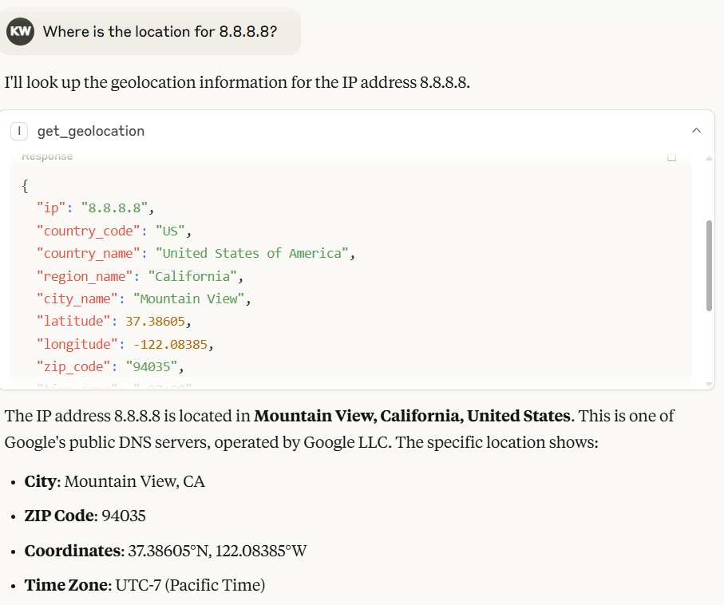

# IP2Location.io MCP server

This is a simple Model Context Protocol (MCP) server implementation for IP2Location.io API. It will return a detailed geolocation information for any given IPv4 or IPv6 address.

<a href="https://glama.ai/mcp/servers/@ip2location/mcp-ip2location-io">
  
</a>

# Features

- **Comprehensive Geolocation Data**: Retrieves a wide range of information, including country, region, city, latitude, longitude, ZIP code, time zone, and more.
- **Network Details**: Provides network-related data such as ASN, ISP, domain, and network speed.
- **Security Insights**: Detects proxy information, including proxy type and provider.
- **Simple Integration**: Built as a `FastMCP` tool, allowing for easy integration into compatible systems.
- **Asynchronous**: Utilizes `httpx` for non-blocking asynchronous API requests.

# Requirement

This MCP server supports to query without an API key, with a limitation of 1,000 queries per day. You can also [sign up](https://www.ip2location.io/sign-up) for a free API key and enjoy up to 50,000 queries per month.

The setup also use `uv`, which can be install by following [the guide](https://modelcontextprotocol.io/quickstart/server#set-up-your-environment).

# Setup

To use this MCP server with Claude Desktop, download the repository to your local, and add the following to your `claude_desktop_config.json`:

```json
{
  "mcpServers": {
    "ip2locationio": {
      "command": "uv",
      "args": [
        "--directory",
        "/path/to/ip2locationio/src",
        "run",
        "server.py"
      ],
      "env": {
        "IP2LOCATION_API_KEY": "<YOUR API key HERE>"
      }
    }
  }
}
```

To get your API key, just [login](https://www.ip2location.io/log-in) to your dashboard and get it from there.

Restart the Claude Desktop after save the changes, and you shall see it pops out in the `Search and tools` menu.

# Usage

Just enter your query about the IP in a chat in Claude Desktop. Some of the example query will be:

- Where is the location of (IP)?
- Where is (IP) located?
- What is the coordinate of (IP)?

For instance, below is the result of the IP 8.8.8.8:



In Claude Desktop, the model will automatically generate the output based on the result returned by IP2Location.io MCP server.

# Environment Variable

`IP2LOCATION_API_KEY`

The IP2Location.io API key, which allows you to query up to 50,000 per month and more details of the IP address. You can [sign up](https://www.ip2location.io/sign-up) for a free API key, or [subscribe](https://www.ip2location.io/pricing) to a plan to enjoy more benefits.

# Tool

`get_geolocation`

**Description**
Fetch geolocation for the given IP address. It helps users to retrieve detailed information such as country, region, city, latitude, longitude, ZIP code, time zone, ASN, and proxy information for any IPv4 or IPv6 address.

**Arguments**
ip (str): The IP address (IPv4 or IPv6) to analyze.

**Returns**
A JSON string containing the geolocation data. The result may include the following fields, depending on your API plan:

- Location & Geography: Country, region, district, city, ZIP code, latitude & longitude, time zone.
- Network & Connectivity: ASN (Autonomous System Number), ISP (Internet Service Provider), domain, net speed, IDD code, area code, address type, usage type.
- Mobile Information: MNC (Mobile Network Code), MCC (Mobile Country Code), Mobile Brand.
- Currency & Language: currency code, currency name, currency symbol, language code, language name.
- Proxy & Security: proxy type, last seen, threat level/type, proxy provider, fraud score.
- Others: IAB category, weather, elevation, population, and more.

If the request fails or the IP address is invalid, the tool will return an error message as a string.
# License

See the LICENSE file.